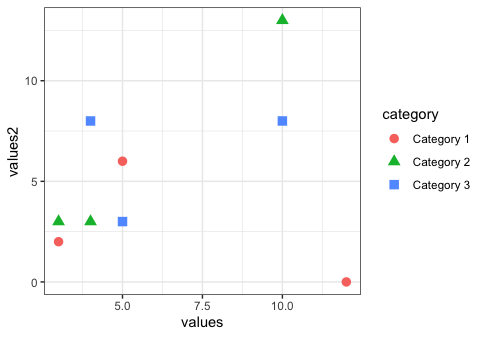

```{r setup, include=FALSE}
options(htmltools.dir.version = FALSE)
knitr::opts_chunk$set(highlight = TRUE)
```

```{r xaringan-themer, include=FALSE}
library(xaringanthemer)
library(ggplot2)
mono_light(
  white_color = "#fff",
  header_font_google = google_font("Roboto Mono", "600"),
  text_font_google = google_font("Roboto Mono", "300", "300i"),
  code_font_google = google_font("Fira Code"),
  text_font_size = "24px",
  code_font_size = "0.7em"
)
```

class: right middle hide-count
background-color: white
background-image: url('assets/cover.jpg')
background-size: cover

<div class='title'><h1><a class="title-link" href="https://fossheim.io/writing/posts/accessible-dataviz-design/">Sarah L. Fossheim's 10 dos and don'ts to keep in mind when designing accessible data visualizations</a></h1></div>

<div class="author">MAYA GANS</div>
<div class="presentation">RStudio Meetup</div>

---

class: right middle hide-count
background-color: white
background-image: url('assets/slide1.jpeg')
background-size: cover

<div class="quote">Accessibility should always be a focus when designing products, and the same goes when working with data visualizations and graphs.</div>

<div class="quote-auth">- Sarah L Fossheim</div>

---

class: hide-count
background-color: white
background-image: url('assets/slide234.jpeg')
background-size: contain


<div class="title-234">
  1. Don't rely on color to explain the data
</div>

```{r, echo=FALSE}
data <- data.frame(
  person = c(
    "Person 1", "Person 1", "Person 1",
    "Person 2", "Person 2", "Person 2",
    "Person 3", "Person 3", "Person 3"
    ),
  category = rep(c(
    "Category 1", "Category 2", "Category 3"
    ), 3),
  values = abs(round(rnorm(9, mean = 5, sd = 4))),
  values2 = abs(round(rnorm(9, mean = 5, sd = 4)))
)
```

.custom-code-css[
```{r, eval=FALSE}
ggplot(data, aes(x = person, y = values)) +
  geom_bar(stat = "identity", aes(fill = category)) 
```
]


---

class: hide-count
background-color: white
background-image: url('assets/slide234.jpeg')
background-size: contain

<div class="title-234">
  1. Don't rely on color to explain the data
</div>

<a class="large-link" href="https://www.color-blindness.com/coblis-color-blindness-simulator/">Coblis —
Color Blindness Simulator</a>


---

class: hide-count
background-color: white
background-image: url('assets/slide234.jpeg')
background-size: contain

<div class="title-234">
  1. Don't rely on color to explain the data
</div>

.custom-code-css[
```{r, eval=FALSE}
library(ggpattern)
ggplot(data, aes(x = person, y = values)) +
  geom_col_pattern(
    aes(pattern = category),
    fill = 'white',
    colour = 'black',
  )
```
]


---

class: hide-count
background-color: white
background-image: url('assets/slide5.jpeg')
background-size: contain

<div class="title-234 white">
  2. Don't use very bright or low-contrast colors
</div>

.custom-code-2[
```{r, eval=FALSE}
colorchecker::contrast_checker()
```
]

```{r, echo=FALSE}
colorchecker::contrast_checker()
```

---

class: hide-count
background-color: white
background-image: url('assets/slide6.jpeg')
background-size: contain

<div class="title-234 white">
  3. Don't hide important data behind interactions
</div>

---

class: hide-count
background-color: white
background-image: url('assets/slide7.jpeg')
background-size: contain

<div class="title-234">
  4. Don't overwhelm the user with information
</div>

---

class: hide-count
background-color: white
background-image: url('assets/slide8.jpeg')
background-size: contain

<div class="title-234">
  5. Use accessibility tools when designing
</div>

<a class="a-slide-title" href="https://www.w3.org/TR/WCAG21/">Web Content Accessibility Guidelines</a>

<a class="a-list-1" href="https://color.a11y.com/">Color Contrast Validator</a>
<a class="a-list-2" href="https://developers.google.com/web/tools/lighthouse">Google Lighthouse</a>
<a class="a-list-3" href="https://www.a11yproject.com/checklist/">A11y Project Checklist</a>

---

class: hide-count
background-color: white
background-image: url('assets/slide234.jpeg')
background-size: contain

<div class="title-234">
  6. Use patterns and shapes in addition to color
</div>

.custom-code-css[
```{r, eval=FALSE}
ggplot(data, aes(x = values, y = values2)) +
  geom_point(stat = "identity", 
             aes(
               color = category
               )
             ) 
```
]


---

class: hide-count
background-color: white
background-image: url('assets/slide234.jpeg')
background-size: contain

<div class="title-234">
  6. Use patterns and shapes in addition to color
</div>

.custom-code-css[
```{r, eval=FALSE}
ggplot(data, aes(x = values, y = values2)) +
  geom_point(stat = "identity", 
             aes(
               color = category, 
               shape = category
               )
             ) 
```
]



---

class: hide-count
background-color: white
background-image: url('assets/slide10.jpeg')
background-size: contain

<div class="title-234">
  7. Use labels and legends
</div>

---

class: hide-count
background-color: white
background-image: url('assets/slide11.jpeg')
background-size: contain

<div class="title-234">
  8. Translate the data into clear language
</div>

---

class: hide-count
background-color: white
background-image: url('assets/slide12.jpeg')
background-size: contain

<div class="title-234">
  9. Provide context and explain the visualization
</div>

---

class: hide-count
background-color: white
background-image: url('assets/slide13.jpeg')
background-size: contain

<div class="title-234">
  10. Focus on accessibility during user interviews
</div>

---

class: hide-count
background-color: white
background-image: url('assets/thankyou.jpeg')
background-size: contain
